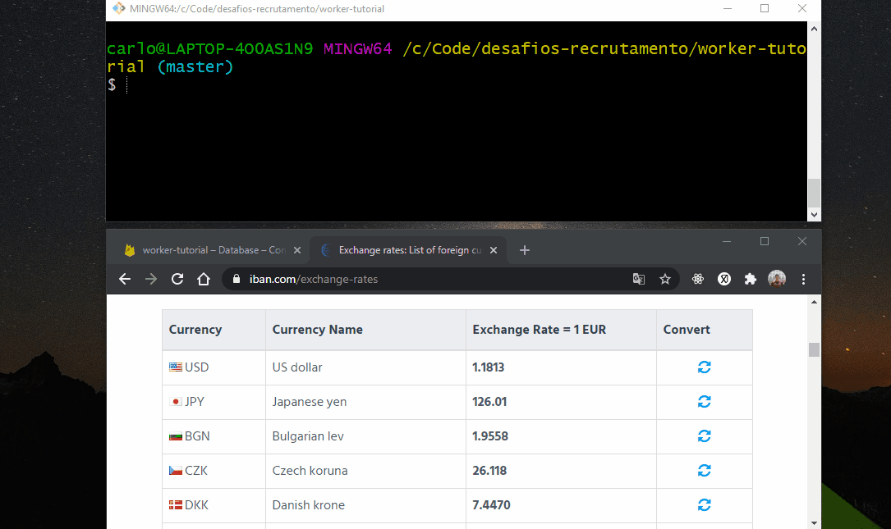
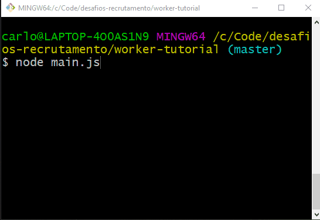

# Iban Crawler Node Firebase 🔥

## About ❔

Project for learning Web Scraping techniques.

The main reason for it was to compare two different techniques: HTTP request web scraping vs Browser run style (Puppeteer).

Also using Node Workers, executing db related jobs in a separated thread.

Crawling this website page's table: https://www.iban.com/exchange-rates.

## Performance Comparison

Fetching and scraping the pure HTML ended up being about 3x faster!
In other hand, it seems that I would be unable to access the JS code of a SPA, for example.

## Technologies ⌨️

Node.js, Axios, Cheerio, Puppeteer and Firebase
